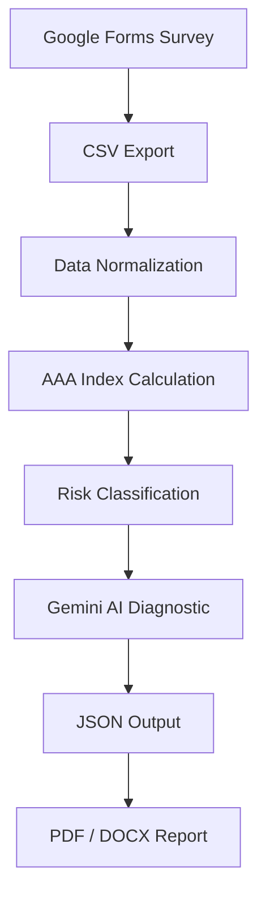

[README.md](https://github.com/user-attachments/files/25747172/README.md)
# AAA — Autonomy, Algorithms & Agency
## An Open Civic Infrastructure for Algorithmic Sovereignty

**AAA** is an open-source diagnostic engine that measures and strengthens **digital sovereignty** in grassroots community organizations. It combines structured survey data, automated processing, and AI-generated recommendations to help communities understand and improve their relationship with digital technologies.

Developed by **Corporación ASFINDES / Vita'e Plena** — Medellín, Colombia.
Piloted with Juntas de Acción Comunal (JACs) in Comunas 12 and 13.

---

## Why AAA Matters

Communities increasingly depend on opaque algorithmic systems without the capacity to measure their autonomy, understand algorithmic influence, or exercise civic agency over digital tools. Platform monopolies extract data and shape information flows while community organizations lack any structured way to assess or respond to this asymmetry.

AAA introduces a measurable framework to diagnose and strengthen democratic sovereignty at the community level. It is not just a diagnostic tool — it is civic infrastructure: a replicable, open system that transforms abstract concepts of digital rights into concrete, actionable metrics that communities can own and act upon.

---

## The AAA Index

The system measures digital sovereignty across three dimensions:

| Dimension | What it measures |
|-----------|-----------------|
| **Autonomy** | Independence from extractive platforms; ownership of tools and data |
| **Algorithms** | Critical understanding of how algorithmic systems shape community decisions |
| **Agency** | Capacity to use technology as a tool for genuine civic participation |

Each organization receives a composite score per dimension (scale 0–20). The AI engine identifies the weakest dimension and generates 3 concrete, context-specific recommendations.

---

## Governance Model

The AAA dimensions are not arbitrary scores. Each dimension is grounded in established frameworks of digital rights, platform accountability, and civic technology theory. Autonomy measures structural independence from extractive platforms. Algorithm measures critical awareness of how computational systems shape community decisions. Agency measures the capacity to translate digital tools into collective civic action.

Scores are calculated as aggregated averages across survey responses per organization, enabling longitudinal tracking and cross-community comparison. The model is designed to be transparent, reproducible, and adaptable to different territorial contexts.

---

## System Architecture



---

## Example: Input & Output

### Input CSV (excerpt)

```csv
Organizacion,Autonomia_AAA,Algoritmo_AAA,Agencia_AAA
JAC Barrio Cristobal,11.67,9.0,8.33
JAC La Pradera,12.33,10.67,10.0
JAC Mirador de Calasanz,9.33,11.33,7.67
```

### AI Diagnostic Output (excerpt)

```
📍 ORGANIZATION: JAC Mirador de Calasanz
📊 METRICS: Autonomy: 9.33 | Algorithm: 11.33 | Agency: 7.67

⚠️  LOWEST DIMENSION: Agency (7.67)

DIAGNOSIS: The JAC has technological knowledge (Algorithm: 11.33) but
community members lack sufficient capacity for incidence and active
participation in controlling these tools.

RECOMMENDATIONS:
1. Implement Critical Digital Literacy Workshops — train the community
   not just to "use" apps, but to understand how data and privacy work.
2. Migrate to Open Source Tools — adopt Nextcloud (files) and Signal
   (communication) to eliminate algorithmic black boxes.
3. Create a Community Data Governance Protocol — formally define who
   collects data in the neighborhood, how, and for what purpose.
```

### JSON Output

```json
{
  "organization": "JAC Mirador de Calasanz",
  "scores": {
    "autonomy": 9.33,
    "algorithm": 11.33,
    "agency": 7.67
  },
  "lowest_dimension": "Agency",
  "risk_level": "medium",
  "risk_flags": ["low_agency"],
  "recommendations": [
    "Implement Critical Digital Literacy Workshops",
    "Migrate to Open Source Tools (Nextcloud, Signal)",
    "Create a Community Data Governance Protocol"
  ]
}
```

---

## How to Reproduce

### Requirements

- Python 3.9+
- A Google Gemini API key ([get one here](https://aistudio.google.com/))

### 1. Clone the repository

```bash
git clone https://github.com/CorpAsfindes/AAA-Autonomy-Algorithms-Agency.git
cd AAA-Autonomy-Algorithms-Agency
```

### 2. Install dependencies

```bash
pip install -r requirements.txt
```

### 3. Configure your API key

Set your Gemini API key as an environment variable — **never hardcode it in the script**:

```bash
export GOOGLE_API_KEY="your_api_key_here"
```

Or in Google Colab, use Secrets (Settings → Secrets → `GOOGLE_API_KEY`).

### 4. Add your data

Place your CSV file in `/data/`. The file must meet these requirements:

**Required columns:**

| Column | Type | Description |
|--------|------|-------------|
| `Organizacion` | string | Full name of the community organization |
| `Autonomia_AAA` | float (0–20) | Score measuring independence from extractive platforms |
| `Algoritmo_AAA` | float (0–20) | Score measuring understanding of algorithmic systems |
| `Agencia_AAA` | float (0–20) | Score measuring capacity for civic action |

**Rules:**
- Scores must be numeric values between 0 and 20
- Each row represents one survey response
- Multiple rows per organization are averaged automatically
- Column names are case-sensitive — use exactly as shown above

See `data/sample_input.csv` for a working example.

### 5. Run the engine

```bash
python src/main.py
```

The engine will process each organization, call the Gemini API, and generate a diagnostic report in `/output/`.

### 6. Run tests

```bash
pytest tests/
```

---

## Repository Structure

```
AAA-Autonomy-Algorithms-Agency/
│
├── data/                   # Raw pilot datasets from Medellín JACs
├── examples/               # Sample CSV inputs and JSON outputs
├── output/                 # Generated diagnostic reports
├── src/                    # Modular diagnostic engine
│   ├── __init__.py
│   ├── data_loader.py
│   ├── metrics.py
│   ├── ai_module.py
│   └── main.py
├── tests/                  # Automated test suite
├── conftest.py             # Pytest path configuration
├── requirements.txt        # Python dependencies
└── README.md
```

---

## Tech Stack

| Component | Tool |
|-----------|------|
| Data collection | Google Forms |
| Processing | Python (pandas) |
| Visualization | Looker Studio |
| AI diagnostics | Google Gemini API (`gemini-2.0-flash`) |
| Output | JSON / PDF / DOCX |

---

## Pilot Results — Medellín 2026

Three JACs participated in the initial pilot (Comunas 12 & 13):

| Organization | Autonomy | Algorithm | Agency | Weakest |
|---|---|---|---|---|
| JAC Barrio Cristobal | 11.67 | 9.00 | 8.33 | Agency |
| JAC La Pradera | 12.33 | 10.67 | 10.00 | Agency |
| JAC Mirador de Calasanz | 9.33 | 11.33 | 7.67 | Agency |
## Field Validation — Medellín 2026

This system has been validated through field sessions with community
leaders in Medellín (March 2026). Facilitators from Juntas de Acción
Comunal in Comunas 12 and 13 participated in structured workshops using
the AAA diagnostic instrument, providing qualitative feedback that
informed the current version of the index and its risk classification
model. Validation instruments and session guides are available in the
`/docs` folder.

**Key finding:** All three organizations showed Agency as their weakest dimension — indicating that communities have some digital tools and awareness, but lack the capacity to use technology as a genuine instrument of civic power.

---

## Roadmap

- [x] Core diagnostic engine (Python + Gemini API)
- [x] Pilot with 3 JACs in Medellín
- [ ] Full open-source release (GitHub)
- [ ] Scale to 20+ JACs across Medellín
- [ ] Multilingual support (Spanish / English)
- [ ] Web interface for non-technical facilitators
- [ ] Federated deployment guide for other cities
- [ ] Development of a federated, community-owned diagnostic model aligned with open governance standards

---

## Contributing

Contributions are welcome. Please open an issue before submitting a pull request.

This project is part of the **Mozilla Foundation Democracy × AI Cohort 2026** application.

---

## License

MIT License — see [LICENSE](LICENSE) for details.

Developed by **Corporación ASFINDES / Vita'e Plena** — Medellín, Colombia.
